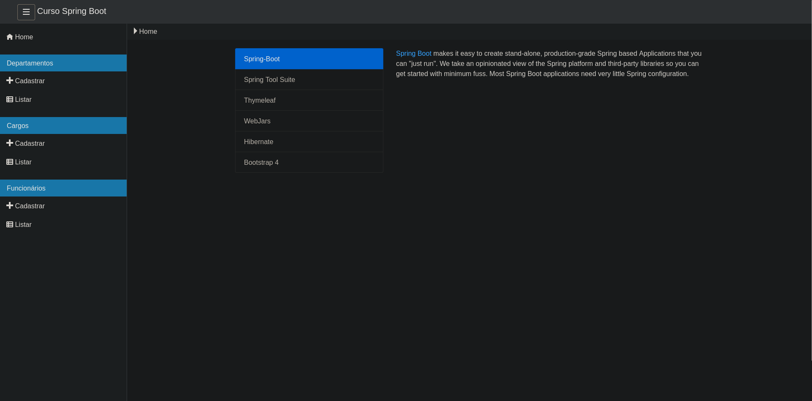
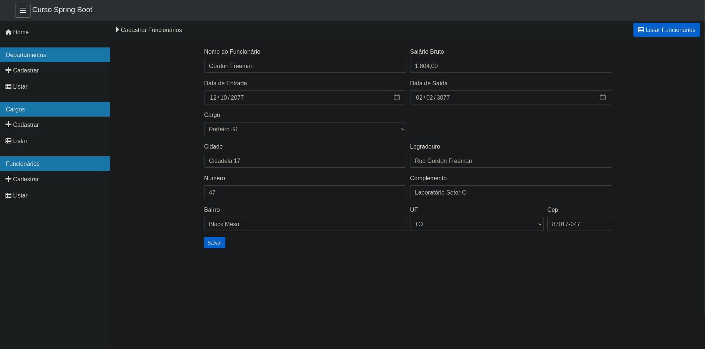

# 🚀 Sistema de Gerenciamento de Funcionários  

[](https://opensource.org/licenses/MIT)  
---

## 📖 Sobre o Projeto  

Este é um **sistema simples de gerenciamento de funcionários** desenvolvido em **Java com Spring Boot**.  
Ele permite **cadastrar, listar, atualizar e excluir funcionários**, seguindo boas práticas de arquitetura.  

🔹 Tecnologias utilizadas:  
- **Spring Boot** (estrutura principal)  
- **Spring MVC** (arquitetura de camadas)  
- **Spring Data JPA** (persistência de dados)  
- **Thymeleaf** (camada de visualização)  
- **Bean Validation** (validação no servidor)  

O Projeto foi feito com a ajuda do [curso de Márcio Ballem](https://www.udemy.com/course/spring-boot-mvc-com-thymeleaf/).  

---
## 🖼️ Demonstrações  

### Página Inicial  
  

### Listagem de Funcionários  


### Formulário de Cadastro  


---

## ⚙️ Configuração do Ambiente  

1. Clone o repositório:  
   ```bash
   git clone git@github.com:Tony27273/Sistema-de-Gerenciamento-de-Funcionarios.git
   cd Sistema-de-Gerenciamento-de-Funcionarios
   ```

2. **Executando o Projeto:**

   No terminal, dentro da pasta do projeto, execute:

   ```bash
   mvn spring-boot:run
   ```

   Ou, para gerar e rodar o JAR:

   ```bash
   mvn clean package
   java -jar target/demo-mvc-0.0.1-SNAPSHOT.jar
   ```

3. **Acesse:**  
   [http://localhost:8080](http://localhost:8080)

---

## 📦 Dependências Necessárias

- **Java 17**  
- **Maven 3.6+**
- **MySQL** (ou outro banco compatível, configurado em `application.properties`)

As principais dependências do projeto (já incluídas no `pom.xml`):

- Spring Boot 3.0.0
- Spring MVC
- Spring Data JPA
- Thymeleaf
- Bean Validation (Jakarta Validation + Hibernate Validator)
- Bootstrap, jQuery e plugins via WebJars


---

**Obs:**  
- Configure o acesso ao banco de dados MySQL em `src/main/resources/application.properties` antes de rodar.
- Para rodar os testes, use:  
  ```bash
  mvn test
  ```
